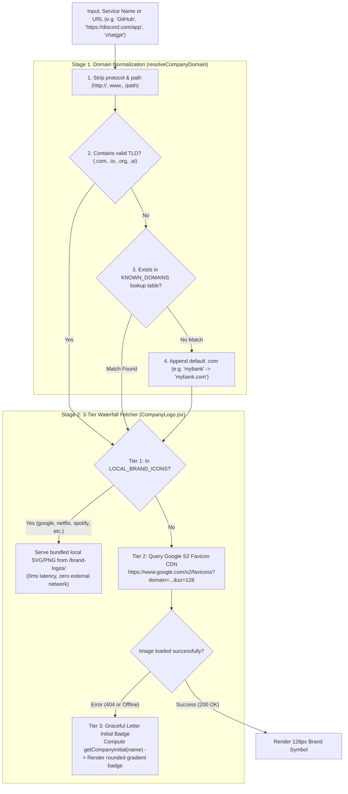

# VaultSync — Detailed System Architecture & Cryptographic Specification

## 1. System Overview & Trust Boundaries

VaultSync operates on an **End-to-End Zero-Knowledge Trust Boundary**. The boundary divides the system into two distinct operational domains:

1. **Client Trust Zone (In-Browser Web Crypto Context)**:
   - Plaintext master passwords, decrypted credentials, raw TOTP secrets, and derived cryptographic keys exist **only** inside ephemeral browser memory (JavaScript heap & `SubtleCrypto` handles).
   - All cryptographic transformations (PBKDF2 key derivation, AES-GCM encryption/decryption, HMAC-SHA1 TOTP generation) take place inside this boundary via hardware-accelerated Web Crypto primitives.
2. **Untrusted Zone (Edge, Network, External)**:
   - Next.js middleware and Clerk handle authentication only (identity verification).
   - **No vault data is stored on, transmitted to, or processed by any server.** The VaultSync server has zero access to encrypted or plaintext credentials.
   - All encrypted vault data resides exclusively in the browser's `localStorage`, keyed by Clerk userId.

```
+---------------------------------------------------------------------------------------+
|                                CLIENT TRUST ZONE (Browser)                            |
|                                                                                       |
|  [ User Interface (Next.js 15 / React 19) ]                                          |
|        |                                                                              |
|        v                                                                              |
|  [ Master Key Derivation ]  <-- User Master Password + User Email Salt               |
|        | (PBKDF2-SHA256, 100k rounds)                                                 |
|        v                                                                              |
|  [ AES-256-GCM Master Key ] (CryptoKey in Volatile RAM, NEVER persisted to disk)       |
|        |                                                                              |
|   +----+--------------------------+-----------------------+                           |
|   | Encrypt Secret                | Decrypt Secret        | Verify Master Key         |
|   | (12-byte random IV)           | (AEAD Tag Check)      | (Canary Decryption)       |
|   +----+--------------------------+-----------------------+                           |
|        | (Ciphertext + IV)                                                            |
+--------|------------------------------------------------------------------------------+
         | HTTPS TLS 1.3
+--------v------------------------------------------------------------------------------+
|                         UNTRUSTED ZONE (Network / Edge)                              |
|                                                                                       |
|  Clerk Middleware: Identity verification only (JWT validation)                        |
|  No vault data is sent to or stored on ANY server.                                   |
+---------------------------------------------------------------------------------------+

All encrypted vault data is stored in browser `localStorage`:  
`localStorage['vaultsync_vault_<userId>']` → `{ verifier, verifier_iv, items: [...] }`
```

---

## 2. Cryptographic Specifications

All cryptography is implemented strictly via the W3C standard **Web Crypto API (`window.crypto.subtle`)** without third-party unvetted JavaScript crypto dependencies.

| Component | Standard / Algorithm | Parameters | Purpose |
|---|---|---|---|
| **Key Derivation** | PBKDF2 (RFC 2898) | Hash: `SHA-256`<br>Iterations: `100,000`<br>Salt: `UTF-8("vaultsync_salt_" + userEmail)` | Derives 256-bit symmetric key from master password; resists GPU/ASIC brute forcing. |
| **Symmetric Encryption** | AES-256-GCM (NIST SP 800-38D) | Key size: `256-bit`<br>IV: `12 bytes (96-bit)` unique per record<br>Tag: `128-bit` integrated authentication tag | Encrypts passwords, notes, and canary strings with confidentiality and integrity guarantee. |
| **Random Number Gen** | CSPRNG | `crypto.getRandomValues(new Uint8Array(12))` | Ensures no IV is ever reused across encryption calls. |
| **Canary Verifier** | AES-256-GCM Verification | Plaintext: `"vaultsync_valid_master_key"` | Allows zero-knowledge validation of master password accuracy without storing password hashes. |
| **Two-Factor TOTP** | RFC 6238 / RFC 4226 | Algorithm: `HMAC-SHA1`<br>Time Step: `30 seconds`<br>Digits: `6`<br>Epoch: `Unix epoch (T0 = 0)` | Computes time-based 6-digit one-time authentication codes directly in the browser. |

---

## 3. Data Schemas & Storage Format

### 3.1. Client-Side Decrypted Record Schema (Ephemeral Memory)
```typescript
interface DecryptedVaultItem {
  id: string;                      // UUID v4
  name: string;                    // e.g. "GitHub"
  username: string;                // e.g. "kaushik"
  password: string;                // Plaintext password (decrypted in memory only)
  url: string;                     // e.g. "github.com"
  category: "Logins" | "Work" | "Entertainment" | "Productivity" | "Shopping" | "Finance" | "Other";
  strength: "Strong" | "Moderate" | "Weak";
  totp_secret?: string;            // Plaintext Base32 TOTP secret or otpauth:// URI
  notes?: string;                  // Plaintext secure notes
  updated_at: string;              // ISO-8601 timestamp
}
```

### 3.2. Encrypted Storage Schema (Browser localStorage)
The structure stored in `localStorage['vaultsync_vault_<userId>']`:

```json
{
  "id": "7f13a07b-891d-409c-a1c2-63bc367db5d9",
  "user_id": "user_2tmXb5...",
  "name": "GitHub",
  "username": "kaushik",
  "url": "github.com",
  "category": "Work",
  "strength": "Strong",
  "encrypted_password": "4l3fK9X+j0Z2e3...base64...",
  "iv": "3Qx9+z...base64_12_bytes...",
  "notes_encrypted": "99zK0L...base64...",
  "notes_iv": "8P2m...base64_12_bytes...",
  "auth_tag": null,
  "icon_type": "github.com",
  "created_at": "2026-09-27T10:14:00.000Z",
  "updated_at": "2026-09-27T10:14:00.000Z"
}
```

### 3.3. Vault Header & Canary Verifier Schema
Stored once per user vault:
```json
{
  "verifier": "k8X2...base64_ciphertext_of_vaultsync_valid_master_key...",
  "verifier_iv": "2Ab4...base64_12_byte_iv...",
  "items": [ /* Array of encrypted items */ ],
  "updated_at": "2026-09-27T10:14:00.000Z"
}
```

---

## 4. End-to-End Operational Workflows

### Workflow 1: Vault Initialization (First-Time User)
1. User authenticates via Clerk OAuth / Email.
2. User enters desired Master Password.
3. Client executes `deriveMasterKey(masterPassword, userEmail)`:
   - Imports raw UTF-8 master password as PBKDF2 base key.
   - Derives 256-bit AES-GCM CryptoKey using 100,000 rounds of SHA-256.
4. Client creates Canary Verifier:
   - Encrypts `"vaultsync_valid_master_key"` with the derived key.
   - Generates `{ verifier: base64, verifier_iv: base64 }`.
5. Client saves canary verifier directly to browser `localStorage`.
6. No server round-trip is required — vault exists purely in the browser.

### Workflow 2: Vault Unlock & Zero-Knowledge Verification
1. User enters Master Password.
2. Client derives trial AES-GCM CryptoKey via `deriveMasterKey(...)`.
3. Client reads stored `{ verifier, verifier_iv }` from browser `localStorage`.
4. Client calls `decryptVaultSecret(verifier, verifier_iv, trialKey)`:
   - **Case A (Correct Password)**: SubtleCrypto decodes `"vaultsync_valid_master_key"`.
     - Trial key is marked as verified Master Key.
     - Key is stored in React memory state and `sessionStorage`.
     - Vault proceeds to decrypt item list.
   - **Case B (Incorrect Password)**: SubtleCrypto throws `OperationError` (AEAD authentication tag mismatch).
     - Client rejects input immediately with `"Incorrect Master Password"`.
     - No credentials or items are exposed.

### Workflow 3: Item Creation & Encryption
1. User fills out item modal (Name, Username, Password, URL, TOTP Secret, Notes).
2. Client generates 12-byte random IV: `window.crypto.getRandomValues(new Uint8Array(12))`.
3. If TOTP secret is present, client packages it into the encrypted payload or encrypted notes block.
4. Client encrypts plaintext password via `SubtleCrypto.encrypt({ name: 'AES-GCM', iv }, masterKey, encodedPassword)`.
5. If notes exist, client generates independent 12-byte IV and encrypts notes.
6. Client saves ciphertext record directly to browser `localStorage`.
7. No server receives or processes any credential data.

### Workflow 4: Automatic Inactivity Lockout
1. A global event listener tracks user interaction (`mousedown`, `keydown`, `touchstart`, `scroll`).
2. An idle timer runs continuously against the configured timeout (default: 5 minutes, 15 minutes, or 30 minutes).
3. When timer expires:
   - Master CryptoKey is destroyed from React state.
   - `sessionStorage.removeItem('vaultsync_session_key')` is triggered.
   - Garbage collector reclaims memory buffer.
   - UI locks immediately, presenting the Master Password Unlock modal.

---

## 5. The Symbol & Brand Logo Resolution Architecture

When an account is displayed or typed, VaultSync automatically renders its official high-resolution symbol using a **3-tier waterfall resolution pipeline**:



### 5.1. Normalization & Canonical Domain Mapping (`lib/utils/logoFetcher.js`)
- Strips URL schemes (`https://`, `http://`, `www.`), paths, and query arguments.
- Leverages `KNOWN_DOMAINS` dictionary covering 100+ platforms across Developer, AI, Social, Gaming, and Financial sectors (e.g. `claude` $\rightarrow$ `anthropic.com`, `chatgpt` $\rightarrow$ `chatgpt.com`, `steam` $\rightarrow$ `steampowered.com`, `twitter` $\rightarrow$ `x.com`).

### 5.2. 3-Tier Fallback Engine (`app/components/CompanyLogo.jsx`)
1. **Tier 1 — Local Static Vector Assets**: Pre-bundled high-fidelity SVGs in `/brand-logos/` for top services (Google, Netflix, Spotify, Slack, Notion, Amazon). Zero latency, instant render.
2. **Tier 2 — Google Favicon S2 Global CDN**:
   - Format: `https://www.google.com/s2/favicons?domain=${encodeURIComponent(domain)}&sz=128`
   - Returns official 128×128 anti-aliased favicon cached across Google edge servers.
3. **Tier 3 — Dynamic Letter Fallback**:
   - Triggered via `onError` if CDN is blocked, device is offline, or domain has no icon.
   - Computes `getCompanyInitial(name)` and renders an elegant, styled badge matching the VaultSync theme.

### 5.3. Zero-Knowledge Symbol Privacy
The logo fetcher only queries the public domain name (e.g. `github.com`). It **never** transmits usernames, passwords, account IDs, or encrypted payloads to the favicon CDN.

---

## 6. Threat Modeling & Security Guarantees

| Threat Vector | Attack Scenario | VaultSync Countermeasure |
|---|---|---|
| **Server Compromise** | Attacker gains full server access. | Zero vault data exists on any server. All secrets remain in the user's browser `localStorage`. Server only runs Clerk authentication. |
| **Database Compromise** | Attacker dumps database/files. | No database stores vault data. All secrets are AES-256-GCM ciphertexts in browser-local storage only. |
| **Man-in-the-Middle (MITM)** | Network eavesdropper intercepts HTTP traffic. | End-to-End TLS 1.3 encryption in transit + payload is already encrypted on client before transmission. |
| **Ciphertext Tampering** | Attacker alters encrypted bytes in storage. | AES-GCM 128-bit authentication tag validation fails on decryption, throwing an error and refusing corrupted data. |
| **Master Password Brute Force** | Attacker tries dictionary attack on master key. | PBKDF2 with 100,000 SHA-256 iterations and per-user unique salt makes large-scale brute force computationally infeasible. |
| **Memory Dump (Post-Session)** | Memory inspection after tab close. | Master keys are in volatile memory, cleared upon lock and completely discarded on tab close/unload. |
| **Cross-Site Scripting (XSS)** | Malicious script injected via third-party library. | Zero external unvetted script tags; Content Security Policy headers; input sanitization across all forms. |
